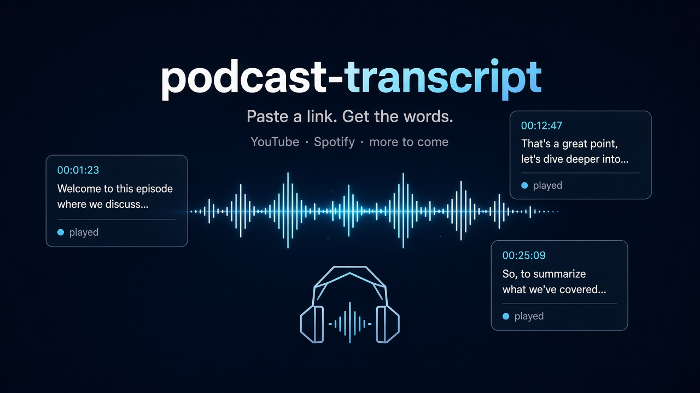

<div align="center">



# podcast-transcript

**Paste a link. Get the words.**

An agent-skill umbrella for fetching transcripts from podcast and video platforms. YouTube captions need no account. Spotify podcast transcripts log in through a browser window when the saved session is missing. More providers can land under the same repo later.

[](LICENSE)
[](https://github.com/jdepoix/youtube-transcript-api)
[](skills/)

</div>

Hand an agent a link. It comes back with the transcript — YouTube videos today, Spotify podcast episodes today, and room for other podcast providers under the same `podcast-transcript` umbrella.

```text
Get the transcript for https://www.youtube.com/watch?v=jNQXAC9IVRw
```

```text
All right, so here we are, in front of the
elephants
the cool thing about these guys is that they
have really...
really really long trunks
and that's cool
```

That sample is the first video ever uploaded to YouTube. The YouTube skill fetched it from the public captions, on a laptop, with the command in this repo.

> [!TIP]
> Agents installing a skill: follow [Agent install](#agent-install) from top to bottom. Finish each verify command before the next step. Provider skills in this umbrella: YouTube is `/youtube-transcript`. Spotify podcasts are `/spotify-transcript`.

## Install

Two commands. Then start a new agent session.

```bash
uv tool install youtube-transcript-api
npx -y skills add ringalls2020/podcast-transcript --skill youtube-transcript -g -y
```

The same install from the full URL:

```bash
npx -y skills add https://github.com/ringalls2020/podcast-transcript --skill youtube-transcript -g -y
```

`uv` missing? Use `pipx install youtube-transcript-api`. The command that must exist afterwards is `youtube_transcript_api`.

## Ask for any of these

| You say | You get |
| --- | --- |
| "Get the transcript for this URL" | The spoken words, one caption line at a time |
| "Give me timestamps" | JSON with `start` and `duration` in seconds |
| "Export captions" | An `.srt` or `.vtt` file |
| "What languages does this video have?" | A table of caption tracks |
| "Translate the captions to Spanish" | YouTube's own caption translation |
| `/youtube-transcript <url>` | The same fetch, from the slash command |
| `/spotify-transcript <url>` | A Spotify episode transcript |

Paste a `youtube.com/watch` link, a `youtu.be` link, a Shorts link, or the 11-character video id. The agent extracts the id. For Spotify, paste an `open.spotify.com/episode/` link, a `spotify:episode:` URI, or a 22-character episode id.

## What a fetch looks like

```bash
python3 skills/youtube-transcript/scripts/fetch_transcript.py \
  "https://www.youtube.com/watch?v=jNQXAC9IVRw"
```

Stdout is the transcript. Stderr is one status line:

```text
fetched jNQXAC9IVRw language=en kind=manual lines=6
```

| Flag | Result |
| --- | --- |
| *(none)* | Plain text |
| `--format json` | Text plus timestamps |
| `--format srt` | SubRip captions |
| `--format webvtt` | WebVTT captions |
| `--languages es en` | Try Spanish, then English |
| `--list` | Every available track |
| `--translate de` | Translate the chosen track to German |

Several URLs can go in one command. Text output for more than one video starts each transcript with `# <video-id>`.

## Where it runs

`npx skills` installs provider skills for the agents it finds on the machine. These are the ones this repo is built against:

| Agent | Invoke it |
| --- | --- |
| Grok Build | `/youtube-transcript` or `/spotify-transcript` |
| Claude Code | `/youtube-transcript` or `/spotify-transcript` |
| Cursor | ask for the transcript |
| Codex | ask for the transcript |
| Gemini CLI | ask for the transcript |
| Cline, Warp, Zed | the skills in `~/.agents/skills` |

The procedure the agent follows for a video is [`skills/youtube-transcript/SKILL.md`](skills/youtube-transcript/SKILL.md). For a Spotify episode it is [`skills/spotify-transcript/SKILL.md`](skills/spotify-transcript/SKILL.md).

## Spotify podcasts

Episode transcripts need one Spotify login. The fetch script opens Spotify in a browser when the saved session is missing, expired, or rejected, waits until you log in, and then prints the transcript. Do not click Log out in that window. A later fetch reuses the session and stays headless.

```bash
uv tool install "spotifyscraper[browser,cli]"
~/.local/share/uv/tools/spotifyscraper/bin/playwright install chromium
npx -y skills add ringalls2020/podcast-transcript --skill spotify-transcript -g -y
```

Then ask:

```text
Get the transcript for https://open.spotify.com/episode/07gKzPFkbvGF0cHoeG7ARS
```

Or run `/spotify-transcript`.

The script accepts an episode URL, a `spotify:episode:` URI, or a 22-character episode id. `--format json` adds `start_ms` timestamps. A show link is not an episode. An episode with no transcript returns `NotFoundError`.

The session cookie stays in SpotifyScraper's owner-only config file. The skill does not ask for it and does not print it. Login details are in [`skills/spotify-transcript/references/auth.md`](skills/spotify-transcript/references/auth.md).

## What it will and will not do

| It will | It will not |
| --- | --- |
| Read manual and auto-generated captions | Download the video or the audio |
| Accept a URL or a video / episode id | Search YouTube or list a channel |
| Run locally, with no API key | Open private, members-only, or age-restricted videos |
| Translate a caption track YouTube already offers | Invent words that were not in the captions |
| Fetch Spotify episode transcripts after one login | Print or ask for the Spotify session cookie |

YouTube sometimes answers `IpBlocked` or `RequestBlocked`, mostly from cloud networks. The fetch script and the library still ran. Proxy setup is in [`skills/youtube-transcript/references/cli.md`](skills/youtube-transcript/references/cli.md).

## Agent install

### 1. Install the CLI

Install `youtube_transcript_api` so it is on `PATH` for every agent on the machine.

```bash
uv tool install youtube-transcript-api
```

Verify:

```bash
command -v youtube_transcript_api
youtube_transcript_api --version
```

Pass: the first command prints a path. The second prints `youtube_transcript_api, version` and a version number.

When `command -v` prints nothing and `uv tool install` succeeded, add `~/.local/bin` to `PATH` and open a new shell. uv puts the executable there.

When `uv` is missing, use the first command that exists:

```bash
pipx install youtube-transcript-api
python3 -m pip install --user youtube-transcript-api
```

The required command name is `youtube_transcript_api`.

For Spotify transcripts, install the browser extra and Chromium. The required command name is `spotifyscraper`.

```bash
uv tool install "spotifyscraper[browser,cli]"
~/.local/share/uv/tools/spotifyscraper/bin/playwright install chromium
command -v spotifyscraper
spotifyscraper session
```

Pass: `command -v` prints a path. `spotifyscraper session` prints a cookie-free session status. A missing session is a pass. The fetch script opens the browser later.

### 2. Install the skill

Use one method. Source for both (umbrella repo):

```text
ringalls2020/podcast-transcript
https://github.com/ringalls2020/podcast-transcript
```

#### Method A — skills CLI

Installs the skill for every agent the CLI detects on this machine.

```bash
npx -y skills add ringalls2020/podcast-transcript --skill youtube-transcript -g -y
npx -y skills add ringalls2020/podcast-transcript --skill spotify-transcript -g -y
```

One agent:

```bash
npx -y skills add ringalls2020/podcast-transcript --skill youtube-transcript -g -a grok -y
npx -y skills add ringalls2020/podcast-transcript --skill youtube-transcript -g -a claude-code -y
npx -y skills add ringalls2020/podcast-transcript --skill youtube-transcript -g -a cursor -y
npx -y skills add ringalls2020/podcast-transcript --skill youtube-transcript -g -a codex -y
npx -y skills add ringalls2020/podcast-transcript --skill youtube-transcript -g -a gemini-cli -y
```

Every agent the CLI knows about, including ones that are not installed:

```bash
npx -y skills add ringalls2020/podcast-transcript --skill youtube-transcript -g -a '*' -y
```

Pass: the command exits 0.

#### Method B — symlink

Use this when `npx` is unavailable. `<repo>` is the absolute path of a local clone. Create a parent directory only for an agent that is installed.

```bash
git clone https://github.com/ringalls2020/podcast-transcript.git
REPO="$PWD/podcast-transcript"
ln -sfn "$REPO/skills/youtube-transcript" "$HOME/.grok/skills/youtube-transcript"
ln -sfn "$REPO/skills/youtube-transcript" "$HOME/.claude/skills/youtube-transcript"
ln -sfn "$REPO/skills/youtube-transcript" "$HOME/.cursor/skills/youtube-transcript"
ln -sfn "$REPO/skills/youtube-transcript" "$HOME/.codex/skills/youtube-transcript"
ln -sfn "$REPO/skills/youtube-transcript" "$HOME/.gemini/skills/youtube-transcript"
ln -sfn "$REPO/skills/youtube-transcript" "$HOME/.agents/skills/youtube-transcript"
ln -sfn "$REPO/skills/spotify-transcript" "$HOME/.grok/skills/spotify-transcript"
ln -sfn "$REPO/skills/spotify-transcript" "$HOME/.claude/skills/spotify-transcript"
ln -sfn "$REPO/skills/spotify-transcript" "$HOME/.cursor/skills/spotify-transcript"
ln -sfn "$REPO/skills/spotify-transcript" "$HOME/.codex/skills/spotify-transcript"
ln -sfn "$REPO/skills/spotify-transcript" "$HOME/.gemini/skills/spotify-transcript"
ln -sfn "$REPO/skills/spotify-transcript" "$HOME/.agents/skills/spotify-transcript"
```

| Agent | Skill directory |
| --- | --- |
| Grok Build | `~/.grok/skills/youtube-transcript` |
| Claude Code | `~/.claude/skills/youtube-transcript` |
| Cursor | `~/.cursor/skills/youtube-transcript` |
| Codex | `~/.codex/skills/youtube-transcript` |
| Gemini CLI | `~/.gemini/skills/youtube-transcript` |
| Cline, Warp, Zed, and other consumers of `~/.agents/skills` | `~/.agents/skills/youtube-transcript` |

Other agents and their global skill paths are listed by `npx skills add --help` under supported agents. Link `skills/youtube-transcript` and `skills/spotify-transcript`. Each folder name matches the `name` in its `SKILL.md`.

Pass: `SKILL.md` exists at the destination.

```bash
test -f "$HOME/.grok/skills/youtube-transcript/SKILL.md"
test -f "$HOME/.claude/skills/youtube-transcript/SKILL.md"
test -f "$HOME/.agents/skills/youtube-transcript/SKILL.md"
```

Check the destinations for the agents installed on that machine. A missing agent directory is a skipped link, not a failed install.

### 3. Verify a fetch

From the repository root:

```bash
python3 skills/youtube-transcript/scripts/fetch_transcript.py "https://www.youtube.com/watch?v=jNQXAC9IVRw"
```

Pass: exit code 0. Stderr contains `fetched jNQXAC9IVRw`. Stdout contains `elephants`.

`IpBlocked` or `RequestBlocked` on stderr means the CLI and the script ran, and YouTube blocked this network. Configure a proxy from [`skills/youtube-transcript/references/cli.md`](skills/youtube-transcript/references/cli.md) and run the same command once more.

### 4. Load it in an agent

Start a new agent session so the skill list reloads. Ask:

```text
Get the transcript for https://www.youtube.com/watch?v=jNQXAC9IVRw
```

Or run `/youtube-transcript`. For a podcast, ask for the transcript of an `open.spotify.com/episode/` link, or run `/spotify-transcript`.

Pass: the agent runs the matching `scripts/fetch_transcript.py` and returns the caption text from stdout. A Spotify run with no saved session opens a browser and waits for login before it prints the transcript.

## Repository layout

```text
skills/youtube-transcript/SKILL.md
skills/youtube-transcript/scripts/fetch_transcript.py
skills/youtube-transcript/references/cli.md
skills/spotify-transcript/SKILL.md
skills/spotify-transcript/scripts/fetch_transcript.py
skills/spotify-transcript/references/auth.md
tests/test_fetch_transcript.py
tests/test_spotify_transcript.py
assets/hero.png
```

## Tests

From the repository root:

```bash
uv run --with pytest python -m pytest
```

Pass: pytest exits 0.

## Uninstall

```bash
npx -y skills remove youtube-transcript -g -y
npx -y skills remove spotify-transcript -g -y
uv tool uninstall youtube-transcript-api
uv tool uninstall spotifyscraper
```

When the skill was linked by hand, remove those symlinks:

```bash
rm "$HOME/.grok/skills/youtube-transcript"
rm "$HOME/.claude/skills/youtube-transcript"
rm "$HOME/.cursor/skills/youtube-transcript"
rm "$HOME/.codex/skills/youtube-transcript"
rm "$HOME/.gemini/skills/youtube-transcript"
rm "$HOME/.agents/skills/youtube-transcript"
rm "$HOME/.grok/skills/spotify-transcript"
rm "$HOME/.claude/skills/spotify-transcript"
rm "$HOME/.cursor/skills/spotify-transcript"
rm "$HOME/.codex/skills/spotify-transcript"
rm "$HOME/.gemini/skills/spotify-transcript"
rm "$HOME/.agents/skills/spotify-transcript"
```

Remove a path only when it points at this skill.

## License

MIT. See [LICENSE](LICENSE).

YouTube captions come from [youtube-transcript-api](https://github.com/jdepoix/youtube-transcript-api) by jdepoix, also MIT. Spotify transcripts come from [SpotifyScraper](https://github.com/AliAkhtari78/SpotifyScraper) by Ali Akhtari, also MIT. This repo is the `podcast-transcript` agent-skill umbrella and the URL-friendly scripts around those libraries.
